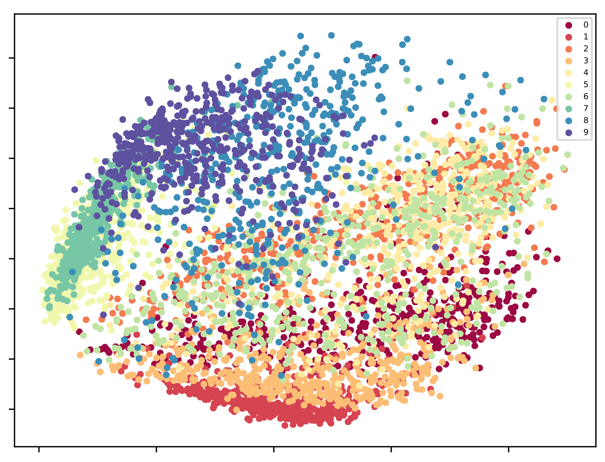
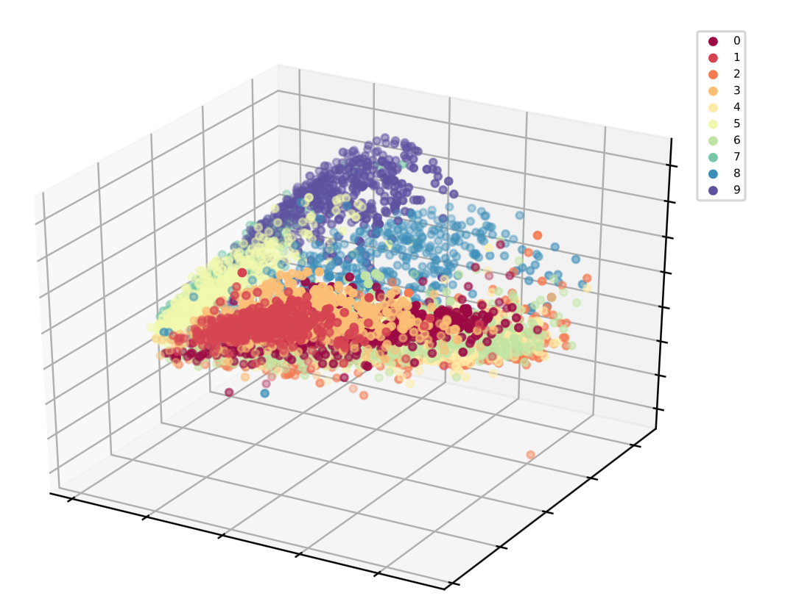
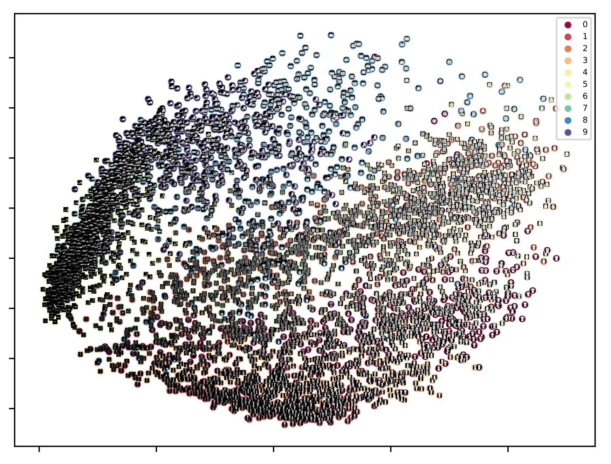

## t-SNE Visualization

This repository is an easy-to-run t-SNE visualization tool for your dataset of choice. It currently supports 2D and 3D plots as well as an optional original image overlay on top of the 2D points.

<p align="center">
 
 
</p>

## Installation

### Ubuntu Installation

First clone this repository, then install the TkInter package by running:

```
sudo apt-get install python3-tk
```

Optionally create a virtualenv for this project:

```
cd tsne-vis
virtualenv -p python3
source venv/bin/activate
```

Then install the python3 dependecies:

```
cd tsne-vis
pip install -r requirements.txt
```


## Usage

<span style="color:red">**Example Command**</span>

```
python main.py --num_samples=5000 --num_dimensions=2 --compute_embeddings=False --with_images=False
```

This will plot a 2D t-SNE plot with no image overlay. Note that the example code uses the [Fashion-MNIST](https://github.com/zalandoresearch/fashion-mnist) dataset which you can download by running: 

```
chmod +x download_data.sh
./download_data.sh
```

You'll only need to **modify** the `load_data` method if you're planning on using your own dataset. Make sure it returns a set of numpy arrays: for example, if embedding grasycale images, you'll want to return an array of images and their associated labels as follows

```
X: (100, 32, 32)
y: (100,)
```

To see all possible command line options, run 

```
python main.py --help
```
which will print:

```
usage: main.py [-h] [--num_samples NUM_SAMPLES]
               [--num_dimensions NUM_DIMENSIONS] [--shuffle SHUFFLE]
               [--compute_embeddings COMPUTE_EMBEDDINGS]
               [--with_images WITH_IMAGES] [--random_seed RANDOM_SEED]
               [--data_dir DATA_DIR] [--plot_dir PLOT_DIR]

t-SNE Visualizer

optional arguments:
  -h, --help            show this help message and exit

Setup:
  --num_samples NUM_SAMPLES
                        # of samples to compute embeddings on. Becomes slow if
                        very high.
  --num_dimensions NUM_DIMENSIONS
                        # of tsne dimensions. Can be 2 or 3.
  --shuffle SHUFFLE     Whether to shuffle the data before embedding.
  --compute_embeddings COMPUTE_EMBEDDINGS
                        Whether to compute embeddings. Do this once per sample
                        size.
  --with_images WITH_IMAGES
                        Whether to overlay images on data points. Only works
                        with 2D plots.
  --random_seed RANDOM_SEED
                        Seed to ensure reproducibility

Path Params:
  --data_dir DATA_DIR   Directory where data is stored
  --plot_dir PLOT_DIR   Directory where plots are saved
```

## Image Overlay

The overlay option only works for 2D plots and relies on matplotlib's `AnnotationBox` method. Here's an example of what it outputs:

<p align="center">
 
</p>
